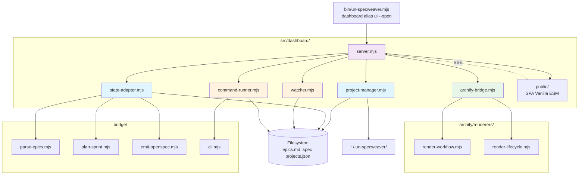
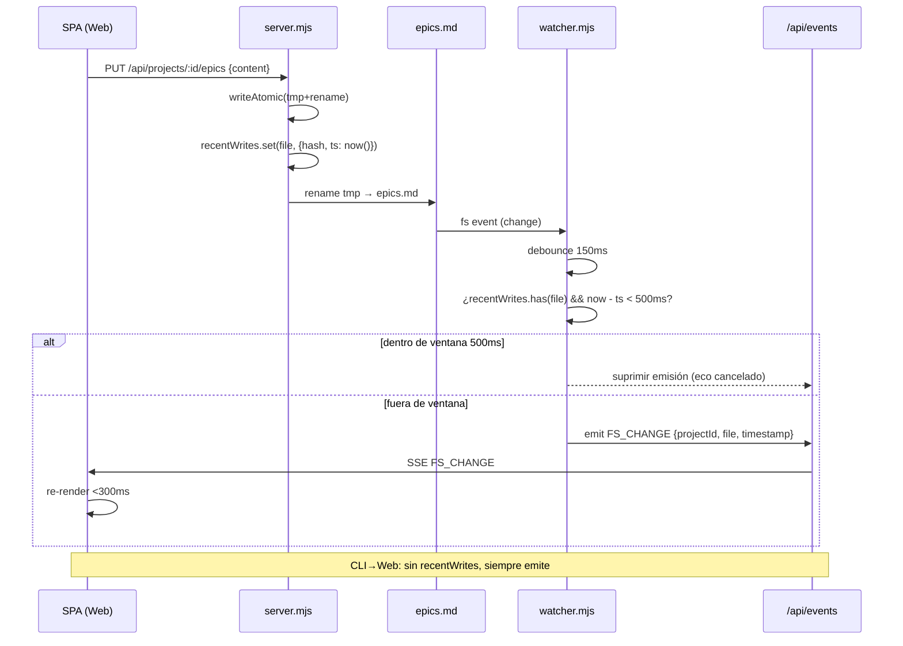

# Spine de Arquitectura — Dashboard Web Multi-Proyecto

> Este spine fija **invariantes** que dos unidades construidas en paralelo no podrían elegir sin divergir. Todo lo estructural detallado es *seed* — verdadero al arranque, propiedad del código después.

## 1. Paradigma y principios

**Paradigma:** *Event-driven + Adapter + Filesystem como fuente de verdad.*

- **Filesystem manda**: `epics.md`, `.spec/**`, `.openspec/**`, `specs/**` son la verdad; el servidor es proyección reactiva, no base de datos.
- **Adaptadores aislados**: `bridge/parse-epics.mjs`, `plan-sprint.mjs`, `emit-openspec.mjs` se consumen vía `state-adapter` que inyecta `projectPath` explícito — nunca cwd global.
- **SSE como bus**: `FS_CHANGE` y `PROJECT_SYNC` tipados fluyen por SSE global + streams por ejecución; la SPA es proyección sin estado autoritativo.
- **Escritura atómica + ventana de eco**: toda mutación Web→disco es tmp+rename y registra `recentWrites` para supresión de 500 ms.

Principios transversales: **ESM estricto**, **sin `process.chdir`**, **rutas absolutas**, **Vanilla ESM sin deps pesadas**, **Archify sandbox**.

## 2. Stack y versiones

| Capa | Tecnología | Versión / Nota |
|------|------------|----------------|
| Runtime | Node.js ESM | **>=20.11** (`engines` en package.json), `type: module` |
| Servidor HTTP | `node:http` nativo | Sin Express/Fastify en v1; router mínimo propio |
| SSE | `text/event-stream` nativo | Keepalive ~25 s, `Cache-Control: no-cache` |
| Watcher | `fs.watch` nativo (preferido) / `chokidar` opcional | `chokidar` solo si `fs.watch` demuestra inestabilidad; `optionalDependencies` |
| Subprocess | `node:child_process` `spawn` | `{ cwd: projectPath, env, stdio: pipe }` |
| Frontend | HTML5 + CSS3 + Vanilla ESM | Sin React/Vue/bundler obligatorio, <100 KB JS inicial |
| Diagramación | `archify/renderers/*/render-*.mjs` en memoria | Invocación directa, sin subprocess; modo degradado si ausente |
| Persistencia global | `~/.un-specweaver/projects.json` | `os.homedir()`, atómico tmp+rename |
| Tests | `node --test` nativo | `test/dashboard.test.mjs` |

> Verificación: Node >=20.11 ya declarado en `package.json#engines`; `node:http` y `node:fs/watch` estables en 20 LTS; `chokidar` 4.x es ESM.

## 3. Estructura de carpetas (seed)

```
src/dashboard/
├── project-manager.mjs      # CRUD atómico sobre ~/.un-specweaver/projects.json
├── state-adapter.mjs        # Adaptadores aislados (parse-epics, plan-sprint, emit-openspec, git/doctor)
├── archify-bridge.mjs       # Mapper estado → JSON Archify + invocación renderers en memoria
├── watcher.mjs              # Multi-watcher filtrado + debounce 150 ms + recentWrites 500 ms
├── command-runner.mjs       # Spawn { cwd } + streaming SSE por executionId
├── server.mjs               # HTTP + SSE + router REST + estáticos SPA
└── public/
    ├── index.html           # Shell SPA, 100% español
    ├── app.mjs              # Bootstrap, SSE client, Quick Switcher, estado por proyecto
    ├── components/
    │   ├── quick-switcher.mjs
    │   ├── tablero-control.mjs
    │   ├── visor-archify.mjs
    │   └── terminal-drawer.mjs
    └── styles.css

bin/un-specweaver.mjs        # comando dashboard (alias ui) + --open/--port/--host
src/layer/commands/es/dashboard.md  # doc del comando en español
test/dashboard.test.mjs      # batería: concurrencia, SSE, eco, cwd
```

Invariante de ubicación: **ningún archivo de dashboard fuera de `src/dashboard/`** salvo `bin/` y `public/` anidado; tests en `test/` raíz.

## 4. Contratos y modelos de datos

### 4.1 Registro global `~/.un-specweaver/projects.json`

```json
{
  "activeProjectId": "proj-uuid-1",
  "projects": [
    {
      "id": "uuid-v4",
      "name": "un-specweaver",
      "path": "/abs/path/a/repo",
      "specDir": ".spec",
      "lastActive": "2026-08-30T03:00:00.000Z",
      "createdAt": "2026-08-30T02:00:00.000Z"
    }
  ]
}
```

Reglas: `path` absoluto canónico (`path.resolve` + `realpath`), `id` UUID v4, `name` derivado de `path.basename` si no se provee, `specDir` autodetectado (`.spec` > `.openspec` > `specs` > default `.spec`), `lastActive`/`createdAt` ISO-8601, escritura atómica.

### 4.2 Estado consolidado `GET /api/projects/:id/state`

```json
{
  "project": { "id": "...", "name": "...", "path": "...", "specDir": "..." },
  "epics": { "all": [], "byStatus": { "pendiente": [], "en_progreso": [], "completada": [] } },
  "sprint": { "active": {}, "planned": [] },
  "git": { "branch": "main", "dirty": false, "ahead": 0 },
  "doctor": { "ok": true, "checks": [] }
}
```

Producido por `state-adapter.mjs` delegando en bridge con `projectPath` explícito.

### 4.3 Esquema Archify (mínimo viable)

`archify-bridge` normaliza a dos esquemas según renderer disponible:

- **workflow**: `{ nodes: [{id, label, status}], edges: [{from, to}], meta }`
- **lifecycle**: `{ phases: [{name, status, items}], currentPhase }`

Si ningún renderer existe → placeholder textual con `X-Archify-Degraded: true`.

### 4.4 SSE — eventos tipados

```
event: FS_CHANGE
data: {"type":"FS_CHANGE","projectId":"...","file":"epics.md","timestamp":"2026-08-30T03:00:00.000Z"}

event: PROJECT_SYNC
data: {"type":"PROJECT_SYNC","projectId":"...","file":".spec/changes/foo/spec.md","timestamp":"..."}

event: COMMAND_OUTPUT
data: {"executionId":"...","chunk":"...","stream":"stdout"}

event: COMMAND_CLOSE
data: {"executionId":"...","exitCode":0}
```

Headers SSE: `Content-Type: text/event-stream`, `Cache-Control: no-cache`, `Connection: keep-alive`, `X-Accel-Buffering: no`.

### 4.5 Endpoints REST

| Método | Ruta | Body / Query | Retorna |
|--------|------|--------------|---------|
| GET | `/api/projects` | — | `200 { projects: [...], activeProjectId }` |
| POST | `/api/projects` | `{ path, name? }` | `201 { project }` / `400 INVALID_PATH` / `409 DUPLICATE` |
| POST | `/api/projects/init` | `{ path, name? }` | `201 { project }` (tras `init`/`adopt`) |
| GET | `/api/projects/:id/state` | — | `200 { epics, sprint, git, doctor }` / `404` |
| GET | `/api/projects/:id/diagram` | — | `200 text/html` (SVG/HTML) / degradado |
| PUT | `/api/projects/:id/epics` | `{ content: string }` | `200` (atómico + recentWrites) |
| POST | `/api/projects/:id/changes` | `{ spec, invariants }` | `201` / `400 INVARIANT_VIOLATION` |
| POST | `/api/projects/:id/commands` | `{ command: "sync|doctor|build|...", args?: [] }` | `202 { executionId }` |
| GET | `/api/projects/:id/commands/:execId/stream` | SSE | stream chunks |
| GET | `/api/events` | SSE global | stream `FS_CHANGE`/`PROJECT_SYNC` |

## 5. Diagramas

### 5.1 Flujo de datos (filesystem ↔ UI)

```mermaid
flowchart LR
  subgraph FS[Filesystem — fuente de verdad]
    EPICS[epics.md / epics.*.md]
    SPEC[.spec / .openspec / specs]
    REG[~/.un-specweaver/projects.json]
  end

  subgraph SRV[un-specweaver HTTP/SSE Server]
    PM[project-manager.mjs]
    SA[state-adapter.mjs]
    AB[archify-bridge.mjs]
    WT[watcher.mjs<br/>debounce 150ms<br/>recentWrites 500ms]
    CR[command-runner.mjs<br/>{cwd: projectPath}]
    HTTP[server.mjs<br/>REST + SSE]
  end

  subgraph UI[Dashboard SPA ESM]
    QS[Quick Switcher Cmd+P]
    TC[Tablero Control]
    VA[Visor Archify<br/>iframe/srcdoc sandbox]
    TD[Terminal Drawer<br/>streaming SSE]
  end

  subgraph AGENTS[Agentes CLI]
    OC[OpenCode / Pi / Cursor]
  end

  OC -- escribe --> EPICS
  OC -- escribe --> SPEC
  EPICS -- fs.watch --> WT
  SPEC -- fs.watch --> WT
  REG -- persistencia atómica --> PM
  PM -- lectura/escritura --> REG
  WT -- FS_CHANGE --> HTTP
  SA -- parse-epics/plan-sprint --> EPICS
  SA -- estado consolidado --> HTTP
  AB -- renderWorkflow/Lifecycle --> VA
  HTTP -- SSE /api/events --> UI
  HTTP -- GET /state /diagram --> UI
  UI -- PUT /epics atómico --> EPICS
  UI -- POST /commands --> CR
  CR -- spawn cwd aislado --> FS
  CR -- SSE chunks --> TD
  QS -- switch <100ms --> TC
  TC -- pulso verde --> HTTP
```

### 5.2 Componentes y dependencias



### 5.3 Secuencia — Cancelación de eco



## 6. Invariantes de arquitectura (AD-N)

> Formato: **Binds** (qué fija) / **Prevents** (qué divergencia evita) / **Rule** (regla verificable).

### AD-01 — Aislamiento cwd (prohibición de `process.chdir`)

- **Binds**: toda operación de proyecto recibe `projectPath` absoluto o `subprocess { cwd }`.
- **Prevents**: dos proyectos concurrentes compartiendo cwd global y pisándose mutuamente.
- **Rule**: `grep -r "process.chdir" src/dashboard/` DEBE retornar 0 resultados; CI lo verifica. Cada función que toca FS/bridge acepta `projectPath: string` como primer o named param.

### AD-02 — Escritura atómica

- **Binds**: `projects.json`, `epics.md`, specs de cambio se escriben vía `writeFile(tmp) + rename(tmp, dest)`.
- **Prevents**: corrupción por caída a mitad de escritura o lectores concurrentes viendo JSON truncado.
- **Rule**: ningún `writeFile` directo sobre destino final; helper `writeAtomic(dest, content)` único en `project-manager`/`server`.

### AD-03 — Filtrado estricto del watcher

- **Binds**:allowlist `epics.md`, `epics.*.md`, `.spec/**`, `.openspec/**`, `specs/**`; denylist `.git/**`, `node_modules/**`, `dist/**`, `build/**`, `.turbo/**`, `.cache/**`.
- **Prevents**: tormenta de eventos por `git`/`install`/`build` y feedback loops.
- **Rule**: tests con fixtures que escriben en `.git/` y `node_modules/` y asertan 0 eventos.

### AD-04 — Debounce 150 ms por proyecto/archivo

- **Binds**: coalescencia 150 ms por `projectId:file` antes de emitir SSE.
- **Prevents**: N eventos por ráfaga de save (editor que escribe tmp+rename+chmod).
- **Rule**: `watcher.mjs` usa `Map<projectId:file, timeout>`; test de ráfaga 10 writes → 1 evento.

### AD-05 — Ventana de supresión de eco 500 ms

- **Binds**: `recentWrites: Map<absPath, {hash, ts}>` poblado en cada `PUT /epics` / `POST /changes` originado en Web.
- **Prevents**: loop Web→FS→watcher→SSE→re-render→write.
- **Rule**: si `now - ts < 500` y `hash === currentHash`, suprimir emisión hacia emisor; test con write Web seguido de fs event <500 ms → 0 eventos.

### AD-06 — SSE tipado y reconexión

- **Binds**: eventos con `event: <TYPE>` y `data: JSON` con `{ type, projectId, file, timestamp }`; headers anti-buffering.
- **Prevents**: cliente incapaz de discriminar `FS_CHANGE` vs `PROJECT_SYNC` o proxies bufferizando SSE.
- **Rule**: `GET /api/events` retorna `text/event-stream` + `Cache-Control: no-cache` + `X-Accel-Buffering: no`; ping `: keepalive` cada 25 s.

### AD-07 — Archify sandbox

- **Binds**: markup Archify entregado vía `iframe srcdoc` o `div.archify-container` con CSS encapsulado (prefijo `.archify-*`, sin selectores globales).
- **Prevents**: estilos del diagrama rompen el shell del dashboard.
- **Rule**: `GET /api/projects/:id/diagram` encapsula; test de regresión visual no requerido en v1, pero snapshot de markup sí.

### AD-08 — Seguridad de paths absolutos

- **Binds**: toda ruta de proyecto es absoluta, validada con `path.isAbsolute`, `fs.stat`, `realpath`; `specDir` resuelto contra `projectPath`.
- **Prevents**: path traversal (`../../etc/passwd`) y registro de rutas inexistentes.
- **Rule**: `POST /api/projects` rechaza no-absolutas con `400 INVALID_PATH`; `project-manager` normaliza con `path.resolve`.

### AD-09 — ESM estricto y sin bundler obligatorio

- **Binds**: `type: module`, `import`/`export` nativo, sin `require`, sin bundler en build.
- **Prevents**: divergencia CommonJS/ESM y deuda de toolchain.
- **Rule**: `node --check` sobre `src/dashboard/**/*.mjs`; `npm test` usa `node --test` nativo.

### AD-10 — SPA Vanilla sin estado autoritativo

- **Binds**: la SPA es proyección; la verdad es FS + `projects.json`; no hay store autoritativo en cliente que sobreviva a F5.
- **Prevents**: divergencia cliente/servidor y conflictos de merge.
- **Rule**: al reconectar SSE, la SPA re-fetchea `GET /state` y `GET /diagram`; no hace optimistic merge de `epics.md`.

## 7. Decisiones con trade-offs

| Decisión | Alternativas | Elección | Binds / Prevents / Rule |
|----------|--------------|----------|-------------------------|
| Servidor HTTP | Express / Fastify / `node:http` | `node:http` nativo | Binds: 0 deps extra. Prevents: lock-in framework. Rule: router de <80 LOC, sin middleware externo. |
| Watcher | `fs.watch` / `fs.watchFile` / `chokidar` | `fs.watch` nativo, `chokidar` opcional | Binds: nativo por defecto. Prevents: dependencia innecesaria. Rule: abstraer `createWatcher()` intercambiable. |
| Persistencia global | `~/.un-specweaver/projects.json` / BD / `~/.config` | `~/.un-specweaver/projects.json` | Binds: JSON atómico simple. Prevents: sobreingeniería. Rule: `os.homedir()` + `path.join`. |
| Archify invocación | subprocess / import en memoria | `import()` en memoria | Binds: <300 ms sin spawn. Prevents: latencia y serialización. Rule: `archify-bridge` hace `import()` dinámico con fallback degradado. |
| Frontend | Vanilla ESM / React / Lit | Vanilla ESM | Binds: <100 KB, sin build. Prevents: toolchain pesado. Rule: Web Components opcionales, no obligatorios. |
| Escritura | `writeFile` directo / tmp+rename | tmp+rename | Ver AD-02. |
| SSE vs WebSocket | SSE / WS | SSE | Binds: unidireccional suficiente (FS→UI) + simple. Prevents: complejidad bidireccional. Rule: WS solo si se necesita RPC futuro (deferido). |

## 8. Seguridad y operación

- **Solo localhost**: `server.mjs` hace `listen` en `127.0.0.1` por defecto; `0.0.0.0` solo con `--host` explícito.
- **Sin auth v1**: al ser localhost, no hay token; si se expone, v2 añade `Authorization: Bearer <token>` generado al boot.
- **Límites**: `command-runner` limita comandos concurrentes por proyecto (default 2), mata procesos huérfanos en `SIGTERM`, y trunca output a 1 MB por ejecución con paginación.
- **Logs**: `console.error` con prefijo `[dashboard] [projectId]` y `timestamp`; no se loguea contenido de archivos.

## 9. Testing y verificación

| Capa | Qué se prueba | Cómo |
|------|---------------|------|
| `project-manager` | Registro, duplicado, path no absoluto, escritura atómica, `activeProjectId` | Unit con tmpdir + `os.homedir` mockeado |
| `state-adapter` | Delegación con `projectPath` explícito, sin `chdir` | Unit con fixtures `epics.md`/`specs` + spy `chdir` = 0 |
| `watcher` | Allowlist/denylist, debounce 150 ms, eco 500 ms, multi-proyecto | Unit con writes programados + fake timers |
| `command-runner` | Spawn con `cwd`, streaming ordenado, kill, límite concurrencia | Unit con `node -e "console.log(...)"` como comando |
| `server` | Endpoints 200/400/404/409, SSE headers, recentWrites | Integration con `node:http` + `fetch` + SSE client |
| `archify-bridge` | Mapper workflow/lifecycle, invoke en memoria, degradado | Unit con renderer mock + snapshot markup |
| E2E | CLI `dashboard --port 0` boot + `GET /api/projects` + SSE FS_CHANGE | `node --test` con servidor efímero |

## 10. Fuera de alcance y deferidos

| Ítem | Estado | Nota |
|------|--------|------|
| Auth multi-usuario / remote | Fuera de alcance | Solo localhost v1 |
| WebSocket bidireccional | Deferido | SSE basta; WS si se necesita RPC cliente→server push |
| Bundler / Vite / esbuild | Deferido | Solo si JS >100 KB |
| Persistencia BD | Deferido | FS + JSON suficiente |
| `chokidar` obligatorio | Deferido | Solo si `fs.watch` falla en CI macOS/Win |
| Historial terminal persistido en disco | Deferido | Memoria + buffer 10k líneas |
| Hot reload del server | Deferido | `node --watch` manual |
| Telemetry / analytics | Fuera de alcance | Local only |

## 11. Riesgos y mitigaciones (arquitectura)

| Riesgo | Mitigación arquitectónica |
|--------|---------------------------|
| `archify/` ausente rompe boot | `archify-bridge` con `try import` + degradado; no throw en `server` |
| `fs.watch` inestable en macOS | Abstraer `createWatcher()` → swap a `chokidar` sin tocar `server` |
| `projects.json` corrupto | Validación Zod-like manual + backup `.bak` + reset a `{ projects: [] }` si inválido |
| Fuga de CSS Archify | `iframe srcdoc` por defecto; `div` solo con prefijo `.archify-` |
| Cwd global accidental | AD-01 + grep CI + tests que espián `process.chdir` |

## 12. Traza PRD ↔ Arquitectura

| FR | AD / Componente |
|----|-----------------|
| FR-001..007 | `project-manager.mjs` + AD-02 + AD-08 |
| FR-010..015 | `state-adapter.mjs` + AD-01 |
| FR-020..026 | `server.mjs` + `command-runner.mjs` + AD-06 + AD-02 |
| FR-030..035 | `watcher.mjs` + AD-03 + AD-04 + AD-05 |
| FR-040..044 | `archify-bridge.mjs` + AD-07 |
| FR-050..056 | `public/` + AD-10 |
| FR-060..064 | `bin/un-specweaver.mjs` + AD-09 |

---

*Spine válido para los 4 epics del Dashboard. Cualquier AD nuevo que contradiga uno existente es conflicto a escalar, no override local.*
